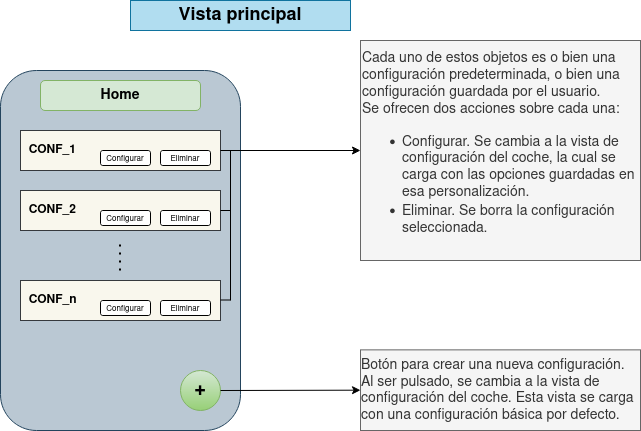
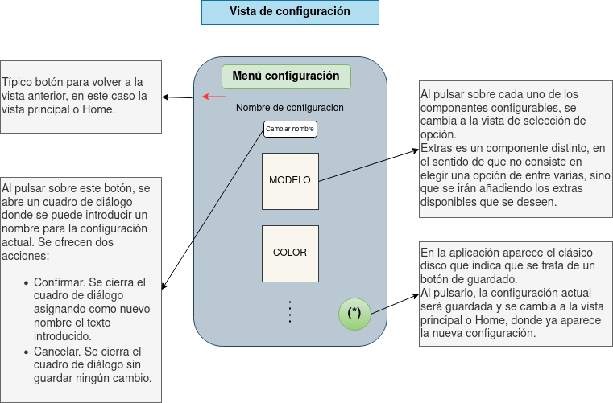
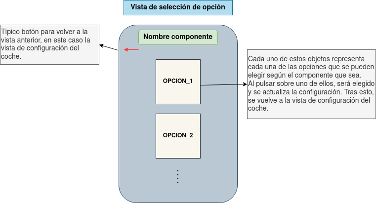
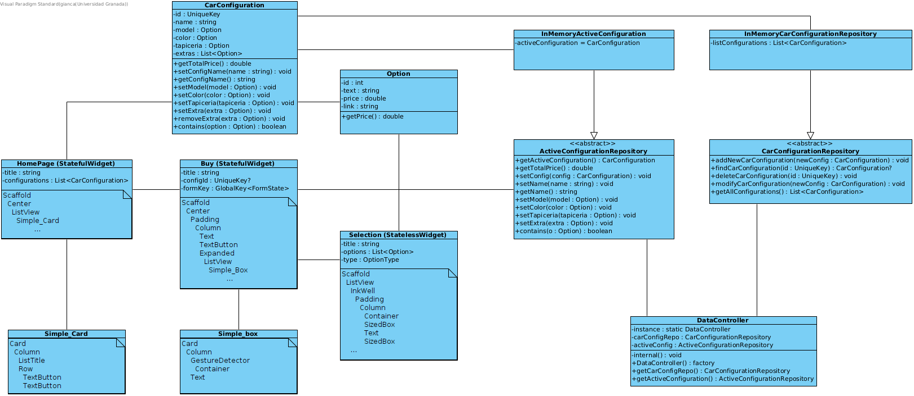
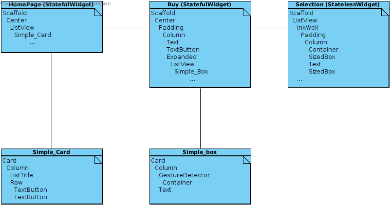
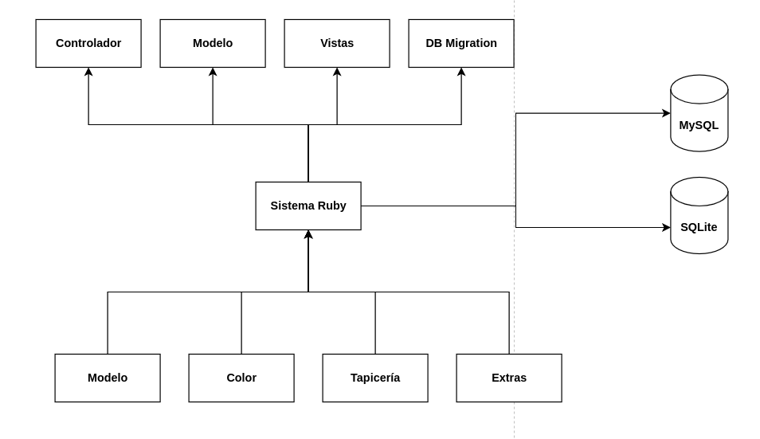
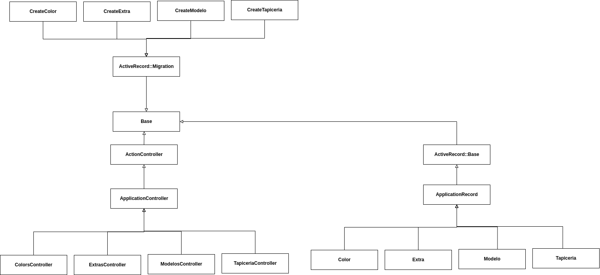

# Resumen global del sistema

Antes de comenzar con los detalles de la aplicación, pensamos que es adecuado hacer una introducción sobre los objetivos globales de esta.

Nuestra aplicación sirve como punto de venta para una hipotética marca de coches, o taller de coches. En la parte del móvil (*Flutter*), tendremos una *app* de compra de automóviles. En dicha compra, podremos personalizar las distintas partes del coche (llantas, color, tapicería y extras), lo que supondrá cierto aumento en el precio.

En la aplicación web, permitiremos a los dueños del taller, marca de coches o parecidos, administrar modelos de coches o ciertas partes de la personalización.

Además, la aplicación web escrita en *Ruby on Rails* expondrá una `API REST` que será consumida por la aplicación móvil. De esta forma, la administración realizada desde la web tendrá un impacto directo, sin tener que modificar el código, en el catálogo que los usuarios tienen disponible desde el móvil.

Por tanto, estaremos manejando dos bases de códigos. En ambas, hemos usado *Github* como sistema de control de versiones. Al tener dos bases de códigos claramente separadas, hemos trabajado en dos repositorios:

1. Repositorio para la aplicación *Flutter* que se puede encontrar en [https://github.com/fervalnav/CarConfigurator](https://github.com/fervalnav/CarConfigurator)
2. Repositorio para la aplicación *web*, que se puede encontrar en [https://github.com/SergioQuijanoRey/CarConfiguratorWeb](https://github.com/SergioQuijanoRey/CarConfiguratorWeb)

En ambos repositorios hemos trabajado de la misma forma. Hemos usado *issues* para marcar las tareas pendientes. Hemos trabajado con distintas ramas, que hemos *mergeado* contra `master  | main` usando *pull requests*.

En esta práctica, se pedía que usáramos una herramienta como *Jira*. Sin embargo, optamos por los proyectos de *Github* por los siguientes motivos:

1. En las prácticas anteriores ya veníamos usando esta *feature* de *Github*, y por lo tanto, ya estábamos familiarizados con esta herramienta, como se puede comprobar en [https://github.com/fervalnav/CarConfigurator/projects/3](https://github.com/fervalnav/CarConfigurator/projects/3)
    - Notar que las antiguas *cards* ya no se encuentran en el proyecto, porque al empezar con la práctica 4 las hemos borrado, para partir desde cero
2. El uso de *issues* como tarjetas en el *Kanban* es directo, y por lo tanto, mucho más cómodo a nuestro parecer (desconociendo si otras herramientas como *Jira* permiten trabajar cómodamente con *issues*)
3. Al tener una lista de *checkboxes* en una *issue*, podemos convertir cada *checkbox* en una *issue* propia. Con esto podemos:
    - Dividir las tareas en subtareas, de forma que cuando estén en la columna *TO-DO* se puedan completar en menos de dos horas
    - Hacer un seguimiento del porcentaje de completado de tareas más complejas

Como se pide en el guión de la práctica, a continuación mostramos una captura de pantalla en la que se muestra el uso de esta herramienta:


Como se puede comprobar en los dos repositorios, los cuatro integrantes hemos trabajado en las dos bases de código. Así hemos podido avanzar más rápido, pues es claro que ambos proyectos son inter-dependientes (ie. para poder conectar *Flutter* con la API REST, primero necesitamos tener desarrollada dicha API).

Y en último lugar, como estamos trabajando con dos bases de código, que aunque estén conectadas, se han diseñado en paralelo (basta con tener en cuenta que la aplicación en *Flutter* la hemos diseñado y codificado, hasta cierto punto, mucho antes de diseñar la *app web* y *API REST*), deberemos mostrar los dos diseños por separado. Esto lo haremos en dos secciones claramente separadas, una para cada base de código.

\newpage

# Aplicación *Flutter*

## Notas iniciales

Como es lógico, hemos partido del código de la práctica anterior. Recordad que habíamos aplicado un patrón repositorio para los distintos elementos que necesitaban de persistencia, acompañado de una patrón *singleton* para hacer fácil su acceso sin tener que inyectar dependencias como parámetros en toda la cascada de métodos.

Es por esto que el cambio necesario para esta práctica es muy sencillo, basta con implementar los repositorios adecuados haciendo uso de la *API REST* desarrollada.

Además, los *tests* serán también sencillos, puesto que podemos usar los que ya teníamos en las clases que implementaban los repositorios en memoria. Podemos considerar estas clases como *mocks* de las clases que interactúan con la base de datos. Puesto que no nos interesa hacer las pruebas tocando directamente la base de datos que tenemos en producción (`clados.ugr.es` en nuestro caso).

Esto último se podría haber hecho usando una librería que *mockease* el acceso a la base de datos, pero como ya lo teníamos programado, consideramos que esto no es ni necesario ni interesante.

## Requisitos funcionales

A partir de los requisitos funcionales de la práctica pasada, desarrollamos estos en mayor detalle, en la siguiente tabla:

1. Gestión de configuraciones

|           |      |
| ---       | ---  |
| Nombre \| Id. RF | 1.1. Comenzar una configuración desde cero |
| Entrada      | Acción del usuario de crear una nueva configuración |
| Procesamiento | Se crea una configuración por defecto para mostrarla |
| Salida | Se muestra la vista con la nueva configuración por defecto. Se permite a partir de esta vista configurar el coche.|


|           |      |
| ---       | ---  |
| Nombre \| Id. RF | 1.2. Borrar una configuración creada |
| Entrada      | Identificador de la configuración a borrar. Debe existir ya en el sistema|
| Procesamiento | Se borra la configuración del sistema de persistencia de datos (en nuestro caso, base de datos `mysql`) |
| Salida | Mensaje de éxito o error según la operación se realice o no correctamente |

|           |      |
| ---       | ---  |
| Nombre \| Id. RF | 1.3 Modificar configuración ya existente |
| Entrada      | Identificador de la configuración existente y sus nuevos datos |
| Procesamiento | Se modifican los datos de la configuración en la persistencia de datos |
| Salida | Mensaje de error o éxito según como se haya desarrollado la operación |

|           |      |
| ---       | ---  |
| Nombre \| Id. RF | 1.4 Almacenar una configuración que se esté modificando actualmente |
| Entrada      | Identificador de la configuración que se está modificando, así como los datos seleccionados actualmente |
| Procesamiento | Se crea una nueva entrada en la base de datos si no hay una configuración con el identificador, o se modifican los datos de la configuración del mismo identificador |
| Salida | Mensaje de error o éxito según como se haya desarrollado la operación |

|           |      |
| ---       | ---  |
| Nombre \| Id. RF | 1.5 Previsualizar una configuración ya existente |
| Entrada      | Identificación de la configuración a visualizar |
| Procesamiento | Ninguno |
| Salida | Se muestran los datos, visualmente, de la configuración seleccionada, al usuario |

## Partes interesadas y sus preocupaciones

Las partes interesadas que identificamos son:

1. Arquitecto: (máster en ingeniería informática) es el director gerente de una pequeña empresa especializada en el desarrollo de aplicaciones web y móviles. Será el arquitecto encargado de elaborar la descripción arquitectónica y supervisar el proceso de desarrollo
    - En este caso, nosotros cuatro seremos los arquitectos de la aplicación
2. Cliente: Dueño de la empresa de coches que contrata nuestros servicios para el desarrollo de las aplicaciones.
3. Desarrolladores: equipo de desarrolladores (nostros cuatro) que se encargan del desarrollo de las aplicación web y móvil. Se comunican entre ellos pues hay una parte en común de desarrollo para las dos aplicaciones a desarrollar
4. Técnico de pruebas: realiza las pruebas de los sistemas software desarrollados.
    - En este caos, también seremos nosotros los técniso de pruebas
5. Usuarios: existirán tres tipos de usuarios
    - Clientes de la app móvil
    - Gestor de catálogo y ventas: usará la app web para introducir nuevos modelos. Aunque pertenezca más al otro sistema, dejamos esto aquí por claridad

La empresa de venta de coches tiene que mantener una gran reputación asociada a su marca.
Por tanto, los siguientes objetivos son importantes:

- Los valores de la empresa deben reflejarse en las aplicaciones desarrolladas
- Las aplicaciones deben presentar una cara “humana” al cliente
- Las aplicaciones deben ser sencillas de usar, accesible para todas las personas
- Las aplicaciones deben ser rápidas y responsivas

Los usuarios expresan las siguientes inquietudes:

- Temo que tenga problemas de accesibilidad (paleta de colores no adecuada para la vista, letras muy pequeñas, botones pequeños…)
- Quiero que el sistema gestione distintos tipos de usuario y que analice los datos del usuario para facilitar la navegación / compra a través del sistema
- Temo que la selección de las distintas variantes de las componentes de una configuración sea compleja y poco usable

Todo esto tendrá un impacto directo en los requisitos funcionales y no funcionales del sistema

\newpage

## Diagrama que muestra la arquitectura

### Diagramas de vistas

Como hacíamos en la práctica anterior, mostramos los diagramas de las vistas de la aplicación, para que sea más fácil comprender el funcionamiento de esta:

{width=100%}

{width=100%}

{width=100%}

\newpage

### Diagramas de clases y de *Widgets*

Empezamos con el diagrama de clases:



Notar que es fácil la modificación, añadiendo las clases que implementan el patrón repositorio (que vienen dados por clases abstractas) usando la *API REST*.

Ahora mostramos el diagrama de *Widgets*:



\newpage

## Criterios de calidad a partir de los requisitos no funcionales

Los criterios de calidad, que vamos a expresar en términos de requisitos funcionales, son:

1. Deben mantenerse protegidos los datos de los usuarios.
2. Configurable
    - Permitir añadir/eliminar/modificar partes configurables, opciones para una parte, métodos de pago guardados, etc.
3. Facilidad de uso
    - Buscamos que la aplicación sea fácil de navegar, intuitiva, destinada a un usuario sin conocimiento experto
4. Accesibiliad
    - El diseño de la *app* está pensada para que sea fácil de visualizar, con buenos contrastes
    - Con fuentes sencillas de visualizar y de buen tamaño
    - Pensando en facilitar el uso a personas con ciertos problemas visuales
5. Cumplimiento con las normativas legales vigentes
    - Por ejemplo, con algunas de las más importantes, como la *Normativa Europea de ley de Protección de Datos*
    - Por el alcance de nuestra aplicación, y por no estar pensada en lanzarase al mercado, no seguimos procedimientos usuales para garantizar estos requisitos (como podría ser el caso de auditorías externas para poder guardar datos de pago, uso de pasarelas de pago externas, ...)

La mayoría de estos requisitos no pueden ser comprobados automáticamente, y por ello debemos verificarlos manualmente antes de lanzar una nueva versión de la aplicación. Por ejemplo, usando la *app* para comprobar algunos de los requisitos, realizando comprobraciones de seguridad en bases de datos...

\newpage

## Diseño de las pruebas

### Pruebas unitarias

Notar que en todos los tests o bien tenemos una función tipo `warmup` que inicializa ciertos datos con los que vamos a jugar, o bien definimos una lista con los datos que vamos a manipular y realizar comprobaciones.

1. Tests sobre la configuración activa actual

| | |
| --- | --- |
| Descripción de la prueba | Tomar la configuración activa |
| Datos requeridos | Ninguno, la configuración activa se toma sin parámetros |
| Condiciones a cumplir | Se toma una configuración activa sin problemas, y el nombre es el nombre por defecto|

| | |
| --- | --- |
| Descripción de la prueba | Hacemos `set` del modelo, en la configuración activa |
| Datos requeridos | La configuración activa, nuevos datos para el modelo |
| Condiciones a cumplir | El modelo de la configuración activa tiene los datos que hemos pasado |

| | |
| --- | --- |
| Descripción de la prueba | Hacemos `set` del color, en la configuración activa |
| Datos requeridos | La configuración activa, nuevos datos para el color |
| Condiciones a cumplir | El color de la configuración activa tiene los datos que hemos pasado |

| | |
| --- | --- |
| Descripción de la prueba | Hacemos `set` del tapicería, en la configuración activa |
| Datos requeridos | La configuración activa, nuevos datos para el tapicería |
| Condiciones a cumplir | El tapicería de la configuración activa tiene los datos que hemos pasado |

| | |
| --- | --- |
| Descripción de la prueba | Añadimos un extra en la configuración activa |
| Datos requeridos | El extra que queremos añadir |
| Condiciones a cumplir | El extra se debe añadir a la configuración que tenemos activa |


| | |
| --- | --- |
| Descripción de la prueba | El cálculo del precio debe ser correcto |
| Datos requeridos | Se toma la configuración activa, y a mitad del test se cambia el modelo |
| Condiciones a cumplir | El precio por defecto debe ser el correcto. Cuando cambiamos de modelo, el nuevo precio debe ser correcto |

2. Tests del repositorio de configuraciones de un coche
    - Disponemos de la función `create_basic_repo` como `warmup`

| | |
| --- | --- |
| Descripción de la prueba | Los valores se almacenan correctamente |
| Datos requeridos | Repositorio creado por `create_basic_repo` |
| Condiciones a cumplir | Debe tener los elementos correctos |


| | |
| --- | --- |
| Descripción de la prueba | La funcionalidad de añadir funciona como se espera |
| Datos requeridos | Datos para añadir a la configuración |
| Condiciones a cumplir | Se debe almacenar bien la nueva configuración. Si la intentamos volver a añadir, como ya está almacenada, no debe almacenarse de nuevo |

| | |
| --- | --- |
| Descripción de la prueba | La funcionalidad de buscar configuraciones funciona como se espera |
| Datos requeridos | Identificador de la configuración que se busca |
| Condiciones a cumplir | Si el identificador es bueno, se debe encontrar bien la configuración. Si la configuración no es buena, se debe retornar un `null` |

| | |
| --- | --- |
| Descripción de la prueba | La funcionalidad de eliminar configuraciones funciona como se espera |
| Datos requeridos | Identificador de la configuración a eliminar |
| Condiciones a cumplir | La configuración se elimina con éxito |

| | |
| --- | --- |
| Descripción de la prueba | Borrar dos veces la misma configuracion solo borra en la primera vez|
| Datos requeridos | Identificador de la configuración que se borra dos veces |
| Condiciones a cumplir | La primera vez, se borra con éxito. La segunda vez, al no encontrarse en el sistema, no se realiza ningún cambio en la persistencia de datos |

3. Test de la clase que usamos para modelar las opciones

| | |
| --- | --- |
| Descripción de la prueba | Crear una función actúa como debería |
| Datos requeridos | Datos de la opción que se crea|
| Condiciones a cumplir | Se crea una opción con los datos correctos|

| | |
| --- | --- |
| Descripción de la prueba | El precio de una opción es el esperado |
| Datos requeridos | Datos de la opción creada |
| Condiciones a cumplir | El precio debe coincidir con el esperado |

### Tests de widgets

| | |
| --- | --- |
| Descripción de la prueba | El botón de eliminar debe eliminar la configuración correcta |
| Datos requeridos | Identificador de la configuración que queremos eliminar |
| Condiciones a cumplir | Tras simular las acciones necesarias, esa configuración ya no se encuentra |

| | |
| --- | --- |
| Descripción de la prueba | El botón de configurar debe cambiar a la vista correcta |
| Datos requeridos | Identificador de la configuración que queremos modificar |
| Condiciones a cumplir | Se debe pasar a la vista de configuración, con los datos asociados a esa configuración |

### Tests de integración


| | |
| --- | --- |
| Descripción de la prueba | Se realiza una configuración desde cero correctamente |
| Datos requeridos | La secuencia de acciones que se realiza|
| Condiciones a cumplir | Se pulsa el botón de configurar de cero. Se guardan los datos. Se vuelve a la vista principal donde se encuentra la configuración, con datos por defecto, guardada en el sistema. |

\newpage

# Aplicación *Ruby on Rails*

## Notas iniciales

Esta aplicación, como ya hemos comentado, ha sido desarrollada usando el comando `rails generate scaffold` intensivamente. Por tanto, solo hemos tenido que codificar manualmente ciertas partes de la aplicación, aquellas en las que queríamos introducir un comportamiento específico que *Ruby on Rails* no nos daba (por ejemplo, estilos personales desarrollados con `css`).

Por tanto, la estructura de la aplicación será la usual en una aplicación sencilla de *Ruby on Rails*. Y por este motivo, intentaremos que los diagramas que representan la arquitectura sean sencillos, señalando las particularidades de nuestro sistema cuando sea necesario.

## Requisitos funcionales

Como ya hemos comentado, la aplicación se encargará de manejar las componentes que están disponibles en el catálogo del comprador, y por tanto, todos nuestros requisitos funcionales irán encaminados a cubrir las necesidades derivadas de esto.

Para evitar ser muy repetitivos, hablaremos de componentes configurables para referirnos a las distintas opciones para el modelo, tapicería, color y extras. Podríamos copiar los mismos requisitos funcionales tres veces, pero esto no aporta nada, porque todas las componentes (modelo, tapicería, color y extras) tendrán el mismo comportamiento.

|           |      |
| ---       | ---  |
| Nombre \| Id. RF | 1.1 Añadir nuevo componente configurable |
| Entrada      | Datos del nuevo componente configurable |
| Procesamiento | Almacenar en la base de datos los datos de la nueva componente, en la tabla adecuada para el tipo de componente |
| Salida | Mensaje de error o éxito, según se haya desarrollado la operación |

|           |      |
| ---       | ---  |
| Nombre \| Id. RF | 1.2 Eliminar un componente configurable |
| Entrada      | Identificación del componente que queremos eliminar |
| Procesamiento | Borrar dicho componente de la base de datos |
| Salida | Mensaje de error o éxito, según se haya desarrollado la operación |

|           |      |
| ---       | ---  |
| Nombre \| Id. RF | 1.3 Modificar los datos de un componente configurable |
| Entrada      | Identificador del componente a modificar, datos con los que modificamos la configuración. Notar que si solo cambiamos un campo (ie. el nombre) debemos pasar obligatoriamente todos los datos de las partes que forman la componente (ie. nombre, color, precio, ...) |
| Procesamiento | Se modifican los datos en la base de datos |
| Salida | Mensaje de error o éxito, según se haya desarrollado la operación. Puede fallar porque el identificador no sea válido o porque los datos que queremos introducir no sean válidos. |


|           |      |
| ---       | ---  |
| Nombre \| Id. RF | 1.4 Modificar los datos de un apartado específico de una componente configurable |
| Entrada      | Identificador del componente a modificar, datos con los que modificamos parte concreta de la configuración, identificador de la parte concreta que modificamos |
| Procesamiento | Se modifican los datos en la base de datos |
| Salida | Mensaje de error o éxito, según se haya desarrollado la operación. Puede fallar porque el identificador de la componente no sea válido, o porque los datos que queremos introducir no sean válidos, o porque la identificación de la parte concreta que modificamos no sea válida. |

\newpage

## Partes interesadas y sus preocupaciones

Las partes interesadas que identificamos son:

1. Arquitecto: (máster en ingeniería informática) es el director gerente de una pequeña empresa especializada en el desarrollo de aplicaciones web y móviles. Será el arquitecto encargado de elaborar la descripción arquitectónica y supervisar el proceso de desarrollo
    - En este caso, nosotros cuatro seremos los arquitectos de la aplicación
2. Cliente: Dueño de la empresa de coches que contrata nuestros servicios para el desarrollo de las aplicaciones.
3. Desarrolladores: equipo de desarrolladores (nostros cuatro) que se encargan del desarrollo de las aplicación web y móvil. Se comunican entre ellos pues hay una parte en común de desarrollo para las dos aplicaciones a desarrollar
4. Técnico de pruebas: realiza las pruebas de los sistemas software desarrollados.
    - En este caos, también seremos nosotros los técniso de pruebas
5. Usuarios: existirán tres tipos de usuarios
    - Clientes de la app móvil
    - Gestor de catálogo y ventas: usará la app web para introducir nuevos modelos. Aunque pertenezca más al otro sistema, dejamos esto aquí por claridad

La empresa de venta de coches tiene que mantener una gran reputación asociada a su marca.
Por tanto, los siguientes objetivos son importantes:

- Los valores de la empresa deben reflejarse en las aplicaciones desarrolladas
- Las aplicaciones deben presentar una cara “humana” al cliente
- Las aplicaciones deben ser sencillas de usar, accesible para todas las personas
- Las aplicaciones deben ser rápidas y responsivas

Los usuarios expresan las siguientes inquietudes:

- Temo que tenga problemas de accesibilidad (paleta de colores no adecuada para la vista, letras muy pequeñas, botones pequeños…)
- Quiero que el sistema gestione distintos tipos de usuario y que analice los datos del usuario para facilitar la navegación / compra a través del sistema
- Temo que la selección de las distintas variantes de las componentes de una configuración sea compleja y poco usable

Todo esto tendrá un impacto directo en los requisitos funcionales y no funcionales del sistema

\newpage

## Diagrama que muestra la arquitectura

A partir de estos diseños, ha sido fácil generar el código, usando principalmente la instrucción `rails generate scaffold` para escribir la cantidad mínima de código necesaria, siguiendo así un **Desarrollo Dirigido por Modelos** o *MDD* como hemos visto en teoría.

Además, como comentaremos a lo largo de esta documentación, tenemos cuatro componentes (modelo, tapicería, color, extras) que exhiben el mismo comportamiento. Por tanto, teniendo esto en cuenta, y que hemos seguido la estructura típica que impone *Ruby on Rails*, intentaremos describir gráficamente la arquitectura de la forma más clara y compacta posible. Intentaremos también no mostrar las partes de *Ruby on Rails* en las que realmente no estamos interesados, como `helpers`, `jobs`, `mailers`, configuraciones concretas de bases de datos, ...

Empezamos con una vista general, en el que se muestran las entidades más abstractas del sistema, y cómo interactúan entre sí:



Con este diagrama, que presenta un alto nivel de abstracción, lo que queremos mostrar es lo siguiente:

1. Tenemos cuatro entidades en nuestra lógica de negocio: modelo, tapicería, color y extras
2. Estas cuatro entidades no interactúan entre sí en este sistema, aunque como ya hemos visto, sí que interactúan entre sí en la aplicación móvil, pues forman parte de un todo, la configuración que el usuario pretende comprar
3. Estas cuatro entidades interactúan (se implementan) en el sistema `Ruby` en cuatro puntos principales:
    1. El controlador, que se encarga de las peticiones `HTTP` y de exponer una *API REST*
    2. El modelo, que define el comportamiento de las entidades
    3. Las vistas, que definen cómo se van a ver las entidades en la *web app* con la que interactúan los *managers* para administrar el catálogo
    4. Las migraciones, que definen la representación de las entidades en la persistencia de datos
4. Como estamos usando migraciones y el sistema `Ruby on Rails`, podemos usar dos sistemas de bases de datos sin demasiados problemas. De hecho, así lo hemos hecho. Hemos usado `sqlite` para desarrollar en local, y `mysql` en el servidor `clados.ugr.es`

Fuera de esto, no aplicamos otros patrones de diseño. `Ruby on Rails` tiene unas convenciones muy fuertes que hacen que todos estos patrones estén impuestos desde el inicio, facilitándonos la creación de una aplicación de cierto tamaño de forma estructurada.

Para aclarar todo lo que he dicho, muestro un diagrama de clases en base a lo anterior. De nuevo, solo muestro las clases interesantes, obviando algunas que no hemos usado para nada:



Notar que no hemos escrito los métodos de las clases, como es lo usual. Esto es porque las cuatro componentes exhiben el mismo comportamiento, y es más cómodo listar ahora los métodos de cada grupo:

1. Controladores:
    - `index`
    - `show`
    - `new`
    - `get`
    - `create`
    - `update`
    - `destroy`
    - `private set_<componente>`
    - `private <componente>_params`
2. Modelos:
    - No tenemos métodos, estos se generan automáticamente por la herencia
    - Lo que tenemos es una forma bastante declarativa de definir los datos del modelo y algunas restricciones, por ejemplo:
    ```ruby
        validates :nombre, presence: true
        validates :nombre, uniqueness: true
    ```
3. Migraciones
    - `change` que llama a `create_table`

\newpage

## Criterios de calidad a partir de los requisitos no funcionales

Los criterios de calidad, que vamos a expresar en términos de requisitos funcionales, son:

1. Deben mantenerse protegidos los datos de los usuarios (en este caso, los datos de los administradores que acceden a la app para manejar el catálogo disponible).
2. Configurable
    - Permitir añadir/eliminar/modificar partes configurables, opciones para una parte, métodos de pago guardados, etc.
3. Facilidad de uso
    - Buscamos que la aplicación sea fácil de navegar, intuitiva, destinada a un usuario sin conocimiento experto
4. Accesibilidad
    - El diseño de la *app* está pensada para que sea fácil de visualizar, con buenos contrastes
    - Con fuentes sencillas de visualizar y de buen tamaño
    - Pensando en facilitar el uso a personas con ciertos problemas visuales
5. Cumplimiento con las normativas legales vigentes
    - Por ejemplo, con algunas de las más importantes, como la *Normativa Europea de ley de Protección de Datos*
    - Por el alcance de nuestra aplicación, y por no estar pensada en lanzarse al mercado, no seguimos procedimientos usuales para garantizar estos requisitos (como podría ser el caso de auditorías externas para poder guardar datos de pago, uso de pasarelas de pago externas, ...)

La mayoría de estos requisitos no pueden ser comprobados automáticamente, y por ello debemos verificarlos manualmente antes de lanzar una nueva versión de la aplicación. Por ejemplo, usando la *app* para comprobar algunos de los requisitos, realizando comprobaciones de seguridad en bases de datos...

Notar que estos requisitos son iguales que en la aplicación *Flutter*. Esto es porque son requisitos que podrían (y deberían) aparecer en cualquier proyecto de Desarrollo del Software.

\newpage

## Diseño de las pruebas

A diferencia de con *Flutter*, al usar la orden `rails generate scaffold`, se generan automáticamente muchas de las pruebas de las que nos podemos aprovechar, pues como se ha visto en el caso de *Flutter*, muchas de estas pruebas son repetitivas (aunque necesarias).

También es muy cómodo tener unas *fixtures* generadas por el desarrollo dirigido a modelos. Aunque hemos tenido que modificar los valores de los atributos para que tengan un mejor sentido semánticamente. Y también para que cuando computemos sumas de precios, por ejemplo, los valores de dicha suma los tengamos controlados.

### Tests de controladores

Tenemos los mismos *tests* de controladores para cada tipo de componente (modelo, tapicería, color y extras). Por tanto, escribo los *tests* una vez para una *componente* general.

En todos estos *tests*, se están usando las *fixtures* para tener una serie de datos con los que jugar.

| | |
| --- | --- |
| Descripción de la prueba | Se debe obtener correctamente el índice del controlador de la componente|
| Datos requeridos | URL de la componente, en la que se expone la API |
| Condiciones a cumplir | Realizar un `GET` a esa dirección URL nos da una respuesta con código de éxito |

| | |
| --- | --- |
| Descripción de la prueba | Se puede crear una nueva instancia de la componente |
| Datos requeridos | URL del recurso para crear nuevas instancias de la componente |
| Condiciones a cumplir | Se debe recibir un código de éxito como respuesta al `GET` |

| | |
| --- | --- |
| Descripción de la prueba | Crear una nueva componente |
| Datos requeridos | Los datos de la nueva componente a crear (ie. el nombre, el precio, ...)|
| Condiciones a cumplir | Tras hacer el `POST` con los datos de la nueva componente, se debe recibir un código de éxito, y debemos ser redirigidos a la página principal de la componente |

| | |
| --- | --- |
| Descripción de la prueba | Se debe poder acceder a una componente en concreto |
| Datos requeridos | Identificación de la componente que queremos mostrar (URL del recurso) |
| Condiciones a cumplir | Tras hacer el `GET` a esa componente, se recibe un código de éxito |

| | |
| --- | --- |
| Descripción de la prueba | Se puede acceder a la página de edición de la componente |
| Datos requeridos | Identificación de la componente en concreto que queremos editar |
| Condiciones a cumplir | Tras hacer el `GET`, se debe obtener un código de éxito |

| | |
| --- | --- |
| Descripción de la prueba | Se debe poder modificar los datos de una componente |
| Datos requeridos | Identificador del recurso, nuevos datos para esa componente |
| Condiciones a cumplir | Tras hacer el `POST` con los nuevos datos, se debe obtener un código de éxito y debemos ser redirigidos a la página principal de esa componente |


| | |
| --- | --- |
| Descripción de la prueba | Se debe poder borrar una instancia de una componente |
| Datos requeridos | Identificador de la componente que queremos borrar |
| Condiciones a cumplir | El número de componentes de ese tipo debe disminuir en uno. Debemos ser redirigidos a la página principal de esa componente |

### Tests de modelos

En este caso, no hemos tenido todo el autogeneración que sí tuvimos con los *tests* de controladores. De nuevo, como los cuatro tipos de componentes exhiben el mismo comportamiento, los *tests* de modelos han sido los mismos para los cuatro tipos. Por tanto, hablo de *componentes* en general para referirme al modelo, color, tapicería y extras.


| | |
| --- | --- |
| Descripción de la prueba | El componente se debe guardar con éxito |
| Datos requeridos | Datos de una nueva componente que vamos a guardar |
| Condiciones a cumplir | La operación de guardado debe funcionar correctamente |

| | |
| --- | --- |
| Descripción de la prueba | No se puede guardar una componente sin nombre |
| Datos requeridos | Una componente que hemos creado en memoria, sin nombre |
| Condiciones a cumplir | El sistema nos muestra (a través de una variable `<componente>.save`) que no se pudo hacer el guardado de la variable |

| | |
| --- | --- |
| Descripción de la prueba | No se pueden guardar dos componentes con el mismo nombre |
| Datos requeridos | Dos componentes creadas en memoria con el mismo nombre |
| Condiciones a cumplir | El primer salvado se realiza con éxito, el segundo salvado no se puede realizar |

| | |
| --- | --- |
| Descripción de la prueba | El borrado de una instancia de una componente se realiza con éxito |
| Datos requeridos | Datos de una nueva componente, que guardamos para después borrar |
| Condiciones a cumplir | Se realiza el borrado de la componente con éxito |

### Tests de integración

De nuevo, tenemos el mismo comportamiento en los cuatro componentes. Así que los *tests* de integración serán los mismos, pero modificando los datos y tipos que se necesitan en cada caso. Y de nuevo, hablo de *componentes* en general para no repetir 4 veces las mismas tablas.

| | |
| --- | --- |
| Descripción de la prueba | Se pueden tomar las instancias de la componente |
| Datos requeridos | Identificador del recurso para esa componente (*url* de modelos, tapicerías, color o extras )|
| Condiciones a cumplir | Se navega a esa *url* con un `GET`, se consigue un código de éxito |

| | |
| --- | --- |
| Descripción de la prueba | Podemos crear una nueva instancia de una componente |
| Datos requeridos | Los datos con los que vamos a crear la nueva instancia de componente |
| Condiciones a cumplir | Hacemos `POSTS` de los datos con los que vamos a crear la nueva instancia de la componente. Obtenemos una respuesta `redirect` y `success`. Además, dicha respuesta nos muestra los datos que hemos introducido. |

| | |
| --- | --- |
| Descripción de la prueba | Podemos crear una nueva instancia de componente, y acto seguido borrarla |
| Datos requeridos | Datos de la nueva instancia que vamos a crear |
| Condiciones a cumplir | Creamos la nueva instancia y recibimos la misma respuesta que en el caso de prueba anterior. Borramos la instancia que se ha creado en último lugar (que debe ser la que hemos creado). Recibimos un código de éxito y de `redirect` a la página principal donde se listan todas las instancias de las componentes |

### Tests de sistemas

De nuevo, uso la palabra *componentes* para referirme a modelo, tapicería, color y extras, para evitar ser repetitivo. Estos tests han sido generados automáticamente al haber usado *Model Driven Design*.

| | |
| --- | --- |
| Descripción de la prueba | Se puede navegar a la vista principal donde se listan todas las instancias de la componente |
| Datos requeridos | URL que tenemos que visitar |
| Condiciones a cumplir | Se visita la URL dada, se observa que estamos en la página correspondiente mirando el título (`<h1>`) de esta|

| | |
| --- | --- |
| Descripción de la prueba | Podemos crear una nueva instancia|
| Datos requeridos | Datos con los que rellenamos el formulario |
| Condiciones a cumplir | Rellenamos los campos de los formularios con los datos adecuados. Clickamos en crear. Se muestra el mensaje de éxito |

| | |
| --- | --- |
| Descripción de la prueba | Podemos editar una instancia de componente |
| Datos requeridos | Datos con los que vamos a editar |
| Condiciones a cumplir | Se clicka en el botón de editar. Se rellenan los campos del formulario con los nuevos datos. Guardamos y comprobamos que recibimos un mensaje de éxito |

| | |
| --- | --- |
| Descripción de la prueba | Podemos borrar una instancia de componente |
| Datos requeridos | URL de la instancia que queremos borrar |
| Condiciones a cumplir | Visitamos la URL del color que queremos borrar. Clickamos en destruir, y comprobamos el mensaje de borrado con éxito |
