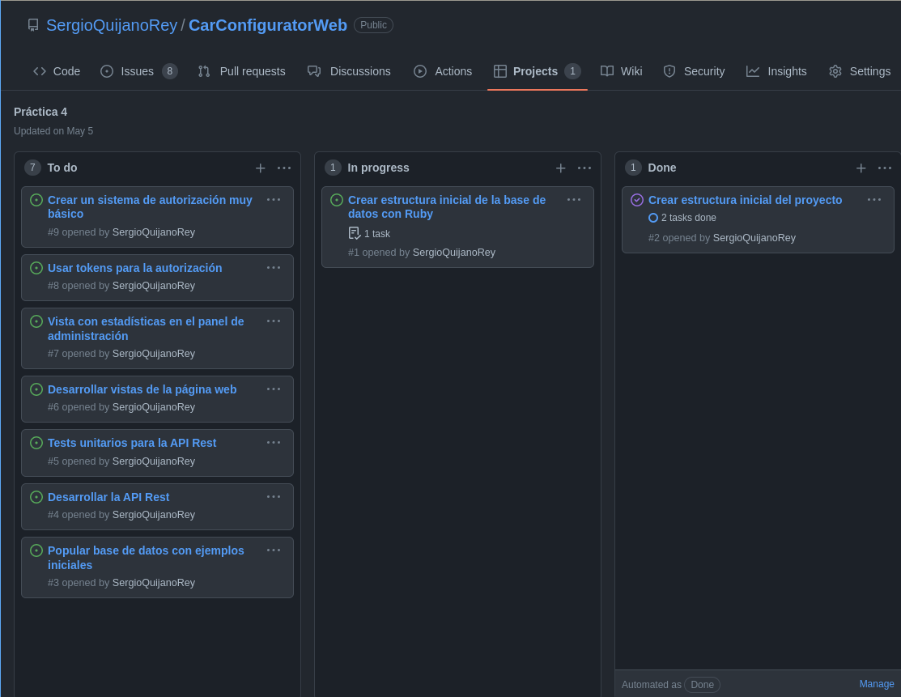

# Resumen global del sistema

Antes de comenzar con los detalles de la aplicación, pensamos que es adecuado hacer una introducción sobre los objetivos globales de esta.

Nuestra aplicación sirve como punto de venta para una hipotética marca de coches, o taller de coches. En la parte del móvil (*Flutter*), tendremos una *app* de compra de automóviles. En dicha compra, podremos personalizar las distintas partes del coche (llantas, color, tapicería y extras), lo que supondrá cierto aumento en el precio.

En la aplicación web, permitiremos a los dueños del taller, marca de coches o parecidos, administrar modelos de coches o ciertas partes de la personalización.

Además, la aplicación web escrita en *Ruby on Rails* expondrá una `API REST` que será consumida por la aplicación móvil. De esta forma, la administración realizada desde la web tendrá un impacto directo, sin tener que modificar el código, en el catálogo que los usuarios tienen disponible desde el móvil.

Por tanto, estaremos manejando dos bases de códigos. En ambas, hemos usado *Github* como sistema de control de versiones. Al tener dos bases de códigos claramente separadas, hemos trabajado en dos repositorios:

1. Repositorio para la aplicación *Flutter* que se puede encontrar en [https://github.com/fervalnav/CarConfigurator](https://github.com/fervalnav/CarConfigurator)
2. Repositorio para la aplicación *web*, que se puede encontrar en [https://github.com/SergioQuijanoRey/CarConfiguratorWeb](https://github.com/SergioQuijanoRey/CarConfiguratorWeb)

En ambos repositorios hemos trabajado de la misma forma. Hemos usado *issues* para marcar las tareas pendientes. Hemos trabajado con distintas ramas, que hemos *mergeado* contra `master  | main` usando *pull requests*.

En esta práctica, se pedía que usáramos una herramienta como *Jira*. Sin embargo, optamos por los proyectos de *Github* por los siguientes motivos:

1. En las prácticas anteriores ya veníamos usando esta *feature* de *Github*, y por lo tanto, ya estábamos familiarizados con esta herramienta, como se puede comprobar en [https://github.com/fervalnav/CarConfigurator/projects/3](https://github.com/fervalnav/CarConfigurator/projects/3)
    - Notar que las antiguas *cards* ya no se encuentran en el proyecto, porque al empezar con la práctica 4 las hemos borrado, para partir desde cero
2. El uso de *issues* como tarjetas en el *Kanban* es directo, y por lo tanto, mucho más cómodo a nuestro parecer (desconociendo si otras herramientas como *Jira* permiten trabajar cómodamente con *issues*)
3. Al tener una lista de *checkboxes* en una *issue*, podemos convertir cada *checkbox* en una *issue* propia. Con esto podemos:
    - Dividir las tareas en subtareas, de forma que cuando estén en la columna *TO-DO* se puedan completar en menos de dos horas
    - Hacer un seguimiento del porcentaje de completado de tareas más complejas

Como se pide en el guión de la práctica, a continuación mostramos una captura de pantalla en la que se muestra el uso de esta herramienta:

Y en último lugar, como estamos trabajando con dos bases de código, que aunque estén conectadas, se han diseñado en paralelo (basta con tener en cuenta que la aplicación en *Flutter* la hemos diseñado y codificado, hasta cierto punto, mucho antes de diseñar la *app web* y *API REST*), deberemos mostrar los dos diseños por separado. Esto lo haremos en dos secciones claramente separadas, una para cada base de código.

\newpage

# Aplicación *Flutter*

\newpage

# Aplicación *Ruby on Rails*
